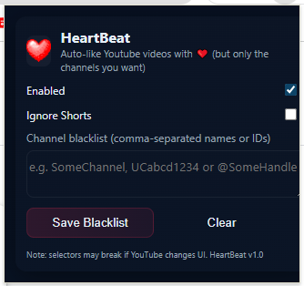

# AutoLike for YouTube ⭐

A lightweight Chrome extension that **automatically likes YouTube videos** from your favorite channels — while letting you blacklist channels you don’t want to auto-like. Works for **normal videos and Shorts**.


## Features

* 👍 Auto-like videos as you watch
* 🎯 Works with YouTube Shorts too
* 📝 Blacklist specific channels to skip auto-liking
* ⚡ Lightweight and fast (runs only when needed)
* 🔒 Settings stored in Chrome sync storage


## 🌐 Installation (Normal Users)

1. Download the latest `heartbeat-dist.zip` from the [Releases page](https://github.com/NwobiaDavid/heartbeat/releases).
2. Unzip it.
3. Open **Chrome** → go to `chrome://extensions/`.
4. Enable **Developer Mode** (top-right).
5. Click **Load unpacked** and select the `dist` folder from inside the unzipped file.
6. Done 🎉


## 🚀 Installation (Developer Mode)

1. Clone this repo:

   ```bash
   git clone https://github.com/NwobiaDavid/heartbeat.git
   cd heartbeat
    ```

2. Install dependencies:
    ```bash
    npm install
    ```

3. Build the extension:
    ```bash
    npm run build
    ```
    This will generate a `dist` folder
    

4. Open **Chrome** → go to `chrome://extensions/`

5. Enable **Developer Mode** (top-right toggle)

6. Click **Load unpacked** and select the **`dist`** folder

7. The extension icon should now appear in your browser 🎉


## ⚙️ Usage

* By default, the extension auto-likes videos.
* Open the popup to:

  * ✅ Enable/disable auto-like
  * 🚫 Add/remove channels from the blacklist
* When watching a video:

  * If the channel is **not blacklisted**, the like button is clicked automatically.
  * If the channel **is blacklisted**, nothing happens.


## 📸 Screenshot



## 🛠️ Tech Notes

* Built with **React** for popup UI
* Uses `chrome.storage.sync` to save settings
* Content script detects the like button and interacts with it
* Handles YouTube’s single-page app navigation so it works even when switching videos without reload


## 🐞 Known Issues

* If auto-like happens on a blacklisted channel, check your stored blacklist for formatting (IDs must match exactly).


## 📜 License

MIT License — free to use, modify, and share.
